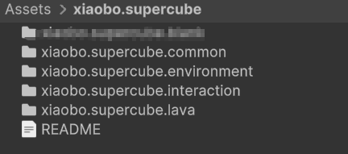
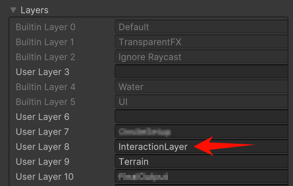

# supercube-package
Effect packages for project SuperCube 

---
## How to run
<div>

</div><br>

- ```xiaobo.supercube.interaction``` Scene that's responsible for change input to texture. Can drag this scene into project if want to add interaction.
- ```xiaobo.supercube.lava``` Scene that includes Lava effect. Can drag this scene into project or copy gameobjects out.
- ```xiaobo.supercube.environment``` Basic environment setup. No need to use this one.
- ```xiaobo.supercube.common``` Utilities. No need to use this one.

## Dependancies
- Unity 6000.0.5
- HDRP
- Visual Effect Graph
- Cinemachine

## Setting Adjustments
- Add Layer "InteractionLayer"
 <div>

</div><br>
